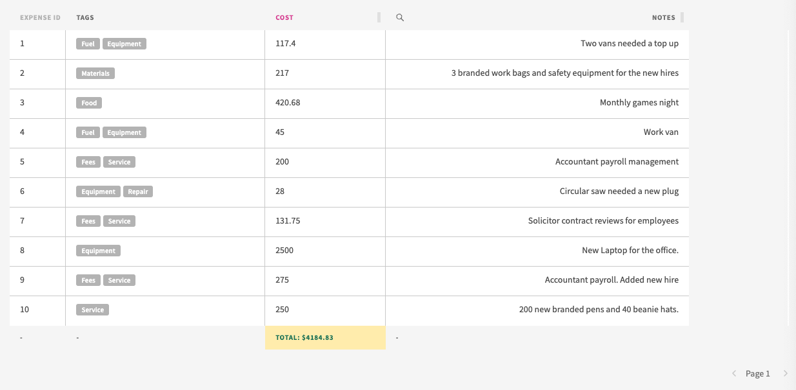
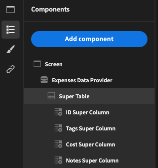
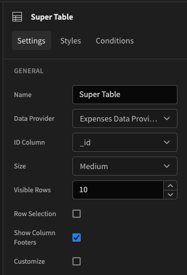
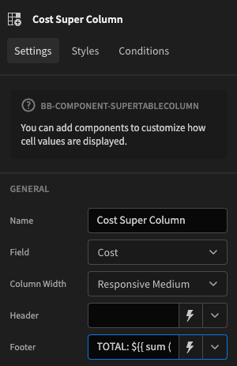
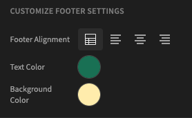

# BB-Component-SuperTable

 - Styleable headers, rows, footers and dividers!
 - Additional actions events!
 - To be used in combination with the [SuperColumn](https://github.com/poirazis/bb-component-SuperTableColumn) and [SuperCell](https://github.com/poirazis/bb-component-SuperTableCell) for fine-grain control and conditional styling.

# Description
A fully customizable Table component with Superpowers!



More on developing and using [Custom plugins](https://docs.budibase.com/docs/custom-plugin)

Find out more about [Budibase](https://github.com/Budibase/budibase).

## Usage instructions

1. Add a Data provider
2. Nest your Super Table
3. Nest a Super Column for each column in your table you wish to display!



### Example: Customizing footers

Tick the *Show Column Footers* setting in the settings panel of the **Super Table**.



Next in your **Super Column** provide a *Footer* value.



In this example, the footer is showing the sum of the rows for the 'Cost' field.
```js
TOTAL: ${{ sum (pluck Expenses Data Provider.Rows 'Cost') }}
```

Default footer styling is set in the **Super Table**. Tick the *Customize* setting and then alter the footer settings.

These default styles can be overridden in each **Super Column** if needed, in a similar way. 

